## SEO audit tehnic intern 

> pentru     bemorepanda.shop

PRESCURATI: MP - main page, CP - category's page, PP - post's page
MOB - regim mobile, DESK - desktop

1. SERVER & HOSTING
   1. +SOLVED HTTPS/SSL - este
   2. !!! Nu toate HEADERS (HTTPS) sunt setate corect pentru cerintele HSTS (Google 2014+)

2. Resource OPTIMIZATION
   1. MP,CP,PP - OFFSCREEN NOT OPTIMIZED! - imaginile care se afla mai jos de orizont - se incarca inainte sa fie vizualizate, DACA se asteapta ca traficul sa fie MOBILE FIRST - google va penaliza asa gen de uzura incorecta a traficului de biti. Dau exemplu:
    
    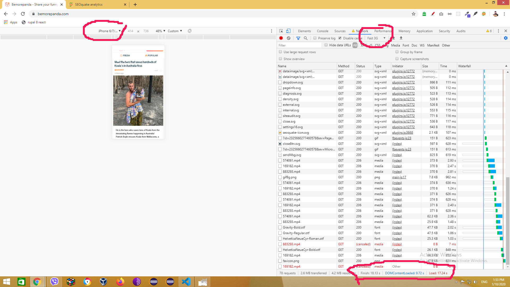

    in acest ecran se poate vedea un experiment cu o viteza medie de Fast 3G (tipic pentru Moldova si zone rurale din Europa) de pe un iPhone 7+-, pagina se incarca 18 secunde (normal ar fi 1-2secunde) si 80% din imaginile incarcate utilizatorul inca nici nu le vede pe ecran - in optimizare - aceasta se considera o pierdere de trafic in van, in special in cazul in care utilizatorul nu va face scroll pana la imaginile de mai jos care nu se vad. 
    
    de exemplu urmatoarele imagini nu sunt pe ecran, dar sunt incarcate imediat

    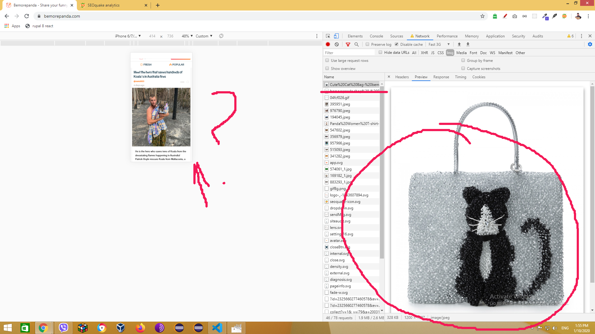

    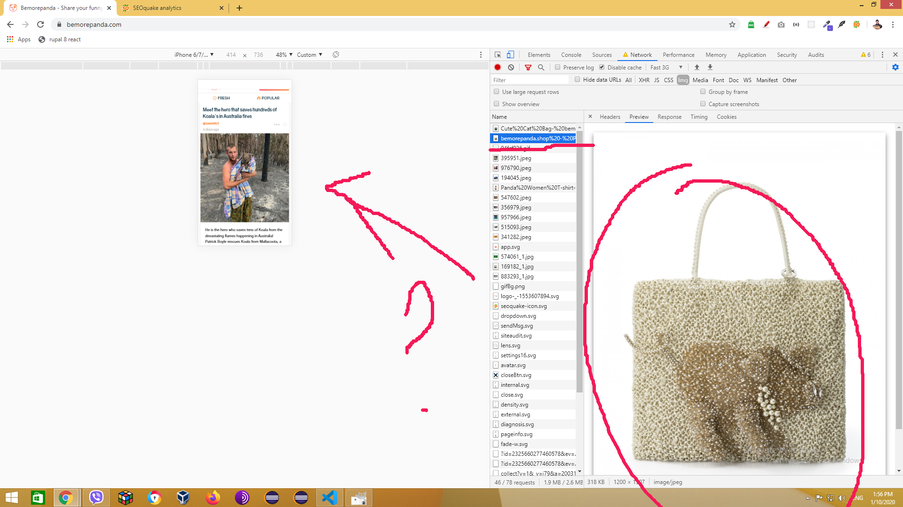

    Recomandare: IMPLIMENTAREA LAZY LOADING pentru resursele media (imagini) !!!

    2. MP,CP,PP - imaginile incarcate pentru versiunea mobil sunt prea mari pentru dimensiunea in care sunt afiate
      RECOMANDARE: utilizati HTML5 responsive images si generati automat imagini cu dimensiuni potrivite pentru marimea in care sunt afisate pe ecran

    3. MP - viteza de incarcare a paginii in cazul "BUSY SITE".
       SIMULAM 100 de utilizatori care se afla in paralel pe site. Si verificam cat timp se incarca pagina in mediu

       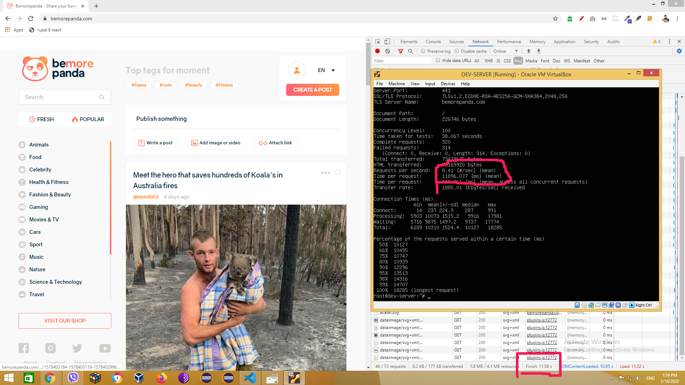 

       dupa cum se vede, in contextul in care fiecare utilizator face un click in mediu la 10 secunde, paginile se vor incarca cu o intarziere de 10-11 secunde... 

       PARTEA SERVER trebuie optimizata (sau scalata pe viitor) pentru ca odata pornita o campanie de publicitate, cu un server nepregatit - se poate ajunge la faptul ca multi vor pleca de pe site sau site-ul va fi penalizat de google din cauza paginilor lente (cand serverul este ocupat).

       Haide sa facem un calcul.
       - in mediu utilizatorii se afla 10 min pe zi per un site de blogging
       - presupunem ca pe zi targetu este 10000 de sesiuni (vizualizari unice)
       - presupunem ca fiecare vizualizator vede doar 5 pagini (cazul pesimist - face doar 5 interactiuni)
       - fiecare pagina a site-ului incarca aproximativ 30+ resurse timp de 5+ secunde (reiesind din testul de mai sus)
          * calculam
            cati utilizatori vor fi in mediu in paralel pe site:
              10000 * 10min / 24 * 60min = aprox 70

       - resetam testul de mai sus :
        
        dupa cum se vede in imaginea de mai jos pentru asa o incarcatura, site-ul va oferi pentru DESK pagina in 7-8 secunde (e ok, dar se poate mai bine) - recomand optimizare resurse si server si testarea acestora INAINTE de a incepe campaniile in masa!

          

       Haideti sa mai facem un calcul, a fost presupus faptul ca cei 10000 de vizitatori vor fi distribuiti uniform pe parcursul a 24 de ore, ceea ce in conditiile reale nu este asa in 2 cazuri cel putin:
          a. Cel mai des daca blog-ul targeteaza un teritoriu (o tara, regiune) atunci utilizatorii apar pe o perioada de 8-10 ore per 24

          - testul pentru acest caz a fost elucidat mai sus (este proximativ - 100 de utilizatori in paralel pe site)

          b. Cand se lanseaza o postare publicitara noua (FB - in special!, Google) - pot exista "bursts" - fluxuri intense de trafic care depasesc uneori de 10x ori traficul obisnuit.
          
          - rulam testul cu 500 de utilizatori in paralel aflati pe site (sa zicem de 7x ori mai mult decat valoarea medie calculata de 70)

             dupa cum se vede in imaginea de mai jos, in cazul unei avalanse de vizitatori, site-ul va oferi pagini cu 13+ secunde intarziere. 
             

         REIESIND din testele de mai sus concluzia este: SAU sa se faca o optimizare/proiectare pentru scalabilitate a site-ului!, sau sa se evite campaniile publicitare care pot genera trafic de 2000+ vizualizari per minut 

         MENTIUNE: a nu se uita ca in testele de aici inca nu figureaza un site complet realizat!

         RECOMANDARE: pentru asigurarea bunii functiuni a site-ului ar fi fost util sa treaca o testare cu 10000+ postari, 100+ utilizatori & comentarii - prezente in paralel! 
     * este oare bine sa gazduiti materialele video direct pe hosting-ul propriu? cat va costa hosting-ul cand vor fi 10000+ vizualizari pe zi din care cel putin 50% vor fi materiale video? nu e mai simplu sa se integreze un canal youtube?

3. URL & DOMAIN
   1. PP, IMBUNATATIRE URL 
      1. sa zicem ca am intrat pe pagina categoriei "Celebrity"
         * aceasta are URL: "https://bemorepanda.com/en/category/celebrity" 
      2. sa zicem ca am intrat pe pagina categoriei "Health & Fitness"
         * aceasta are URL: "https://bemorepanda.com/en/category/health-fitness" 
         * ACESTE DOUA URL-uri (si multe altele) dubleaza peste 70% din lungimea lor, SOLUTIE - eliminarea cuvantului "category" din adrese
         * HINT - daca ar fi posibil programatic (sau din adminca) sa se poata in loc de "category" adauga cuvinte cheie in dependenta de categorie, ca sa formeze fraze cheie gen: "/life-of/celebrity" sau "/about/health-fitness", etc.. ?
         * CA SA FIE CLAR DESPRE CE ZIC, comparati aceste [3 fraze in cautare](https://trends.google.com/trends/explore?geo=US&q=category%20celebrity,life%20of%20celebrity,fun%20with%20celebrity) 

      3. Exista cuvinte inutile in adrese, de ex:
       1. "bemorepanda.com/en/**tag**/dog" - pagina de cautare dupa tag-ul dog, la ce bun este cuvantul "tag" ? acesta dizolva semantica tuturor adreselor care se formeaza in baza tag-urilor
       2. "bemorepanda.com/en/**posts**/**1573838480**-someones-soul-is-definitely-trapped-in-there-im-sure-of-it" - pagina oricarei postari? aceasta nu este un CLEAN URL, in primul rand contine "posts" - dizolva, contine timestampul "1573838480" si contine cuvinte cu relevanta redusa care de obicei se filtreaza automat gen "in", "of", "for" etc... ceea ce duce la scaderea importantei textului url-ului in cautare. Ar trebui sa se aplice principiul celor 5-7 cuvinte si toate sa fie relevante!
       3. aceiasi problema e si in categorii: "bemorepanda.com/en/**category**/fashion-and-beauty" - "category" este un cuvant care nu participa in cautari aproape deloc! totusi el este dublat un URL pentru fiecare categorie si ocupa 30%+ din continutul adresei.
       * deci o buna parte din URL-uri sunt "diluate" si se dubleaza partial (coeficientul de unicitate e foarte scazut!)
       * ca sa fie mai clar, aduc pentru comparatie un screen legat de frecventa cautarilor vs compozitia frazei de cautare:
        
          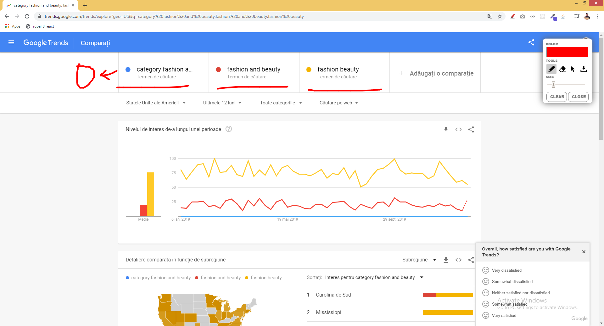  

          zero cautari utilizand combinatia de cuvinte "category fashion and beauty", cu cat mai laconic e textul in punctele cheie ale unei pagini, cu atat mai revelant va fi rezultatul!   

      !!! IDEEA ESTE CA - google cand cand calculeaza relevanta indexarii, foloseste printre multe alte reguli si PROXIMITY (cat de aproape este textul cautat - de cel gasit). Cu cat e mai LUNG URL-ul si cu cat mai multe segmente "inutile" contine, cu atat proximitatea scade!

4. HTML & SEMANTICS
   1. HEADINGS - H1-H3 
      MP,CP,PP - aceleasi probleme ca si pe site-ul SHOP
      * !!! ANTETELE (h1,h2,h3)  - trebuiesc reparate neaparat si tre sa contina text UNIC si RELEVANT pentru tematica site-ului !!!
   1. sunt erori grave in HTML (noscript cu "img") in head??? (-0.5)
   2. urmatorul ecran vorbeste de la sine (-1)
      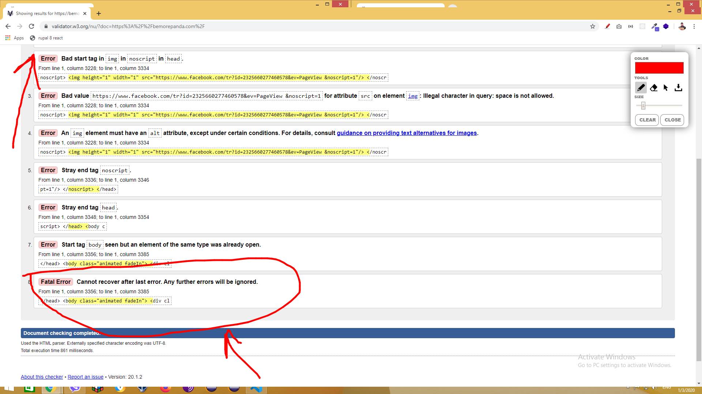       
      
      asa gen de erori pot crea mai departe sute de erori de PARSING (citire) a continutului!
   3. elementul MAIN nu este utilizat corect - in el apar elemente care SE REPETA PE FIECARE PAGINA! desi acesta tre sa contina partea unica a continutului fiecarei pagini! (-1)
      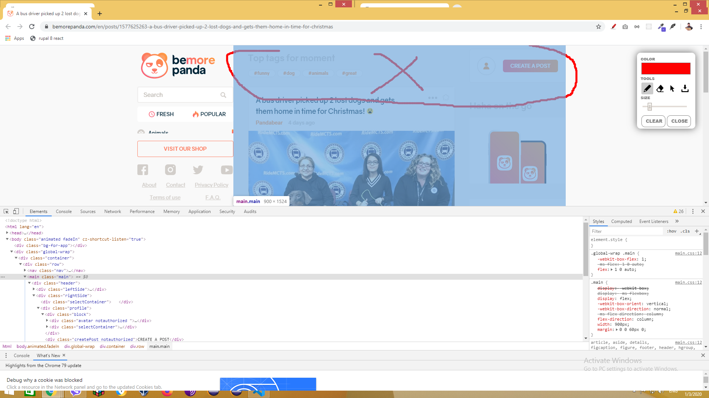    
   4. Lipsesc elemente semantice esentiale: HEADER, FOOTER, SECTION, ASIDE, ARTICLE
   5. +SOLVED heading-urile statice contin text IRELEVANT (h1,h2,h3)    
      
      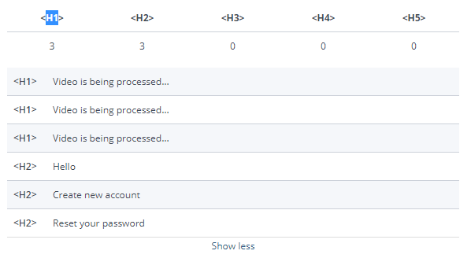 
   6. care este reason-ul acest element - pana sa se incarce dinamic HTML prin javascript sa contina H1 - cu video is being processed... ? dupa care in loc de H1 sa se incarce un link aici cu titlul? 

      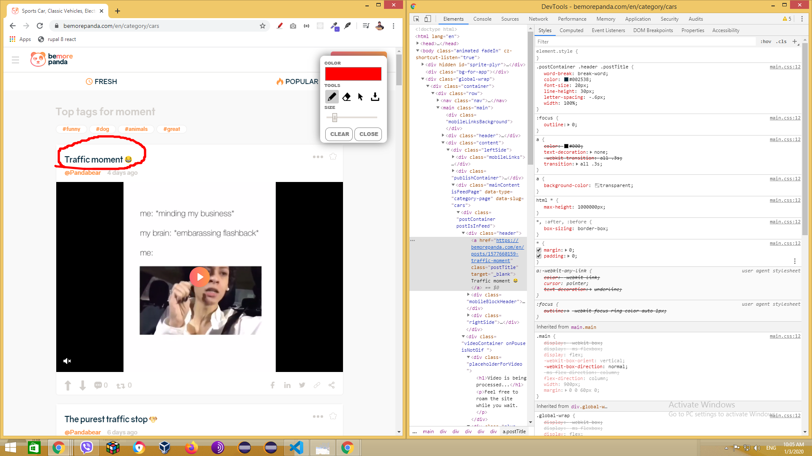  

      in cel mai rau caz acesta ar fi un text bine de plasat in H3 sau H2 
   7. +SOLVED MP, CP - Fiecare postare listata in pagina principala si in categorii - NU ARE TITLU   
       
      RECOMANDABIL e sa se utilizez h3, se pierde esenta titlutlui in intregul text!
     
   8. +SOLVED PP - Pagina postarii, de ce titlul nu este imbracat in H1? nu este acesta CHEIA postarii?
      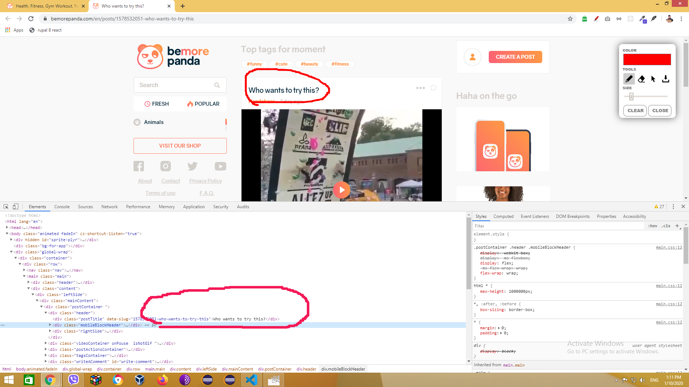 
      RECOMANDABIL e sa se utilizeze h1, se pierde esenta titlutlui in intregul text!
   9. PP - Pagina postarii, sectiunea nu are titlu 
      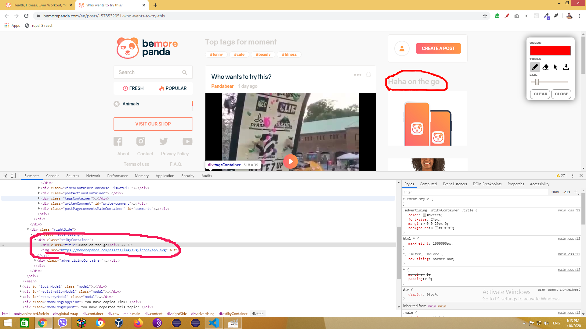 
      RECOMANDABIL e sa se utilizeze h2
     

5. Micro Markup & Structured Data
   1. MP,CP,PP -> Schema.org - !!! LIPSESTE marcarea semantica !!! 
      * Recomandari:
        1. Sa se adauge tipul "https://schema.org/Blog" asociat cu intregul website
        2. Sa se adauge tipul "https://schema.org/BlogPosting"  asociat cu fiecare POSTARE din blog
        3. Sa se adauge tipul "https://schema.org/Review"  asociat cu cu voturile acordate postarilor
        4. Sa se verifice validatea datelor adaugate prin "https://search.google.com/structured-data/testing-tool" 

6. +SOLVED UX / UI
   1. MOB, MP,CP,PP - SEARCH BAR nu este direct accesibil, sute de review-uri vorbesc despre faptul ca utilizatorii pr site-uri de tip blog folosesc cautarea foarte des, cel putin sa fie scoasa in bara de sus direct - pictograma
         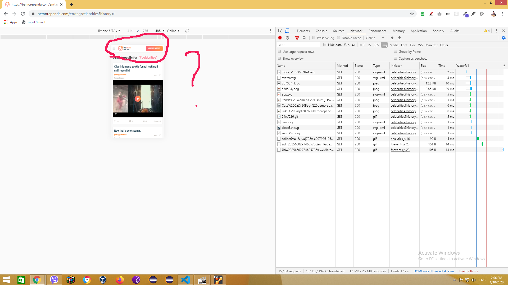 
   2. Iarasi SEARCH INTERACTION - pentru a cauta, tre sa intru in meniu, sa activez "search" si abia apoi sa caut, - recomandate - sa se activeze campul de cautare automat!     
   3. Din punct de vedere UI/UX mi se pare gresit sa se porneasca autoplay - E UNA la mana faptul ca facebook isi permite (pentru ca traficul de pe retele sociale nu este contorizat aproape de nici un provider de telefonie mobila) in schimb traficul de pe website-ul DVS este contorizat, eu intentionat am facut asa un scenariu - daca userul face scroll pana in drept cu un video si intamplator este deranjat de cineva si se opreste acolo fara intentia de a viziona, in 60 de secunde i s-au dus un scroll de 10 ecrane in jos mi-a luat parox 14mb din trafic, fara ca eu sa fiu interesat de vreun video. 

   4. Care este reason-ul sa apara aceasta inscriptie in versiunea Mobila - atunci cand ecran e si asa putin, in timp ce pe versiunea Desktop - ea lipseste?

   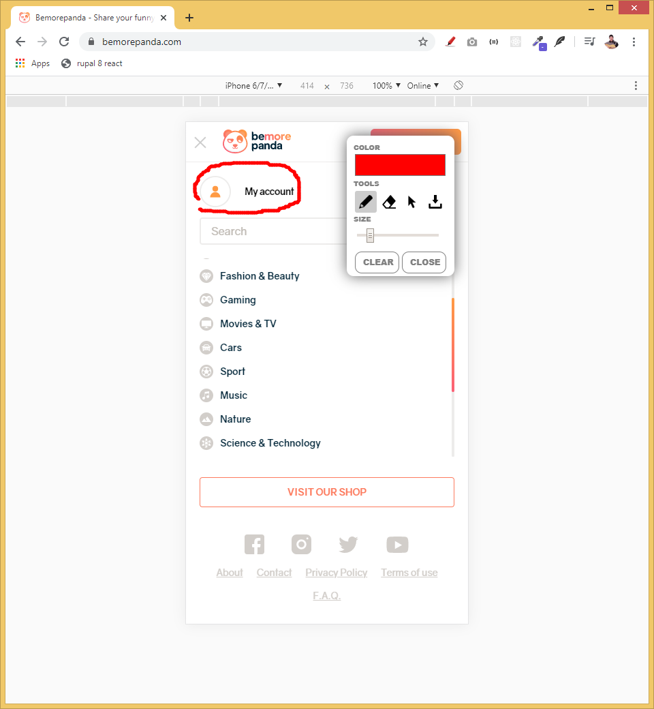 

7. +SOLVED - due to the populatiry & sharing / Accesibilitate si Crawling
   1. MP, CP -  Infinite SCroll (efectul de incarcare infinita prin Javascript) nu este optimizat pentru Google si alte motoare de cautare. 
    proof, daca va uitati pe imagine, am scrollat pana s-a incarcat prin JS un careva post (aflat mai jos de primul ecran, (postarea are 3 saptamani, deci trebuia deja sa apara in google) - dupa care rulez cautarea dupa fraza cheie exacta indicand site-ul sursa) - zero rezultate!:

    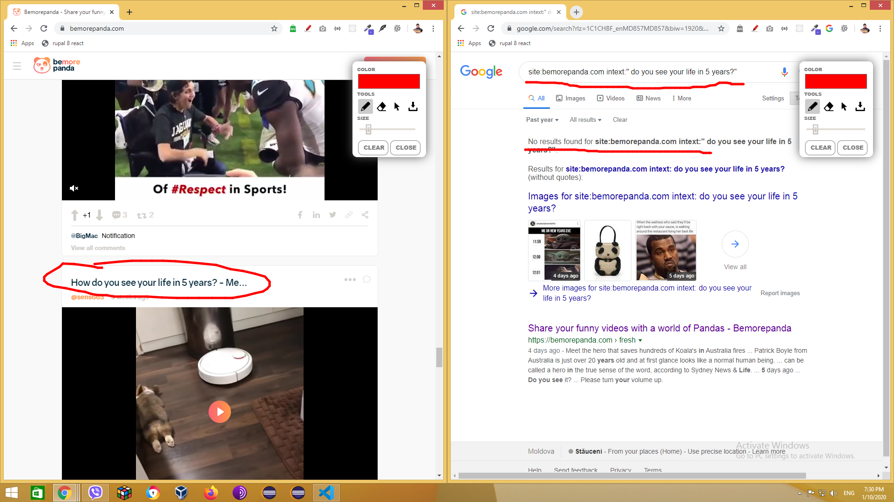

    in timp ce postarea MUUULT mai noua (4 zile) incarcata static pe primul ecran - este vizibila

    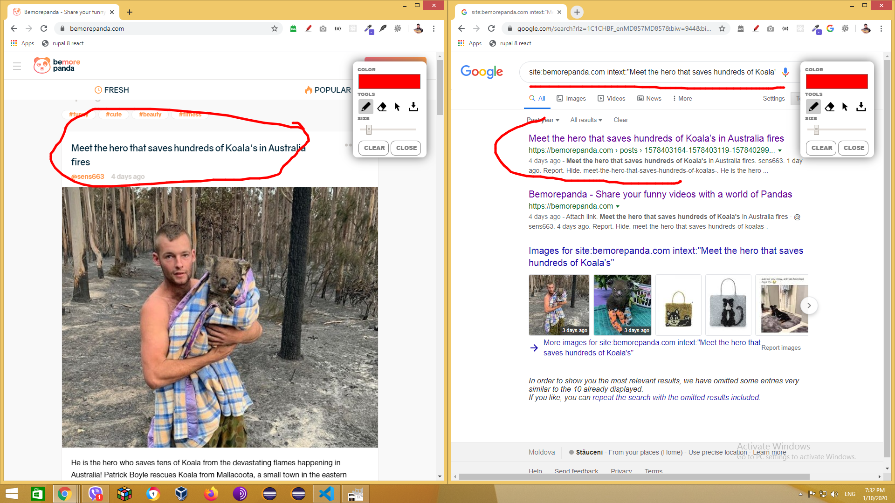

   SOLUTIE - sa se plaseze un link (e bine si pentru UX) cu adresa urmatorului segment de continut, - la moment nici un motor de cautare nu incarca urmatoare pagina daca nu primeste o adresa cu aceasta pagina
   sau scoasa in sitemap.xml sau plasat un "a href" cu adresa urmatoarei pagini CHIAR daca ea se incarca automat in browser! 
8. Google PAGE SPEED / INSIGHTS
   1. s-a intamplat exact ce am prognozat, viteza pentru mobil a scazut drastic odata ce site-ul a inceput sa fie vizitat... nota din partea google 30/100 puteti [verifica aici](https://developers.google.com/speed/pagespeed/insights/?url=https%3A%2F%2Fbemorepanda.com%2Fen&tab=mobile) 
   2. daca va creste traficul si mai mult, de la 27 de secunde pentru o pagina - incarcarea va dura pana la 60 de secunde - rezultat - penalitati din partea google (demoting slow pages since 2013) si utilizatori nemultumiti

9. alexa rank - arata bine (vedem aici)[https://www.alexa.com/siteinfo/bemorepanda.com]
   1. in 2 luni traficul a crescut enorm, dupa cum arata graficul s-ar putea dubla in mai putin de o luna - ceea ce inseamna probleme tehnice si mai mari in ceea ce tine viteza
   2. locul 1700000 in US  - e o pozitie buna!
   3. ma sperie bounce rate-ul de 75%+ ... prin google Analytics tre de inspectat harta vizitatorilor si de determinat DE CE acestia pleaca de pe site in masura de 3/4
   
