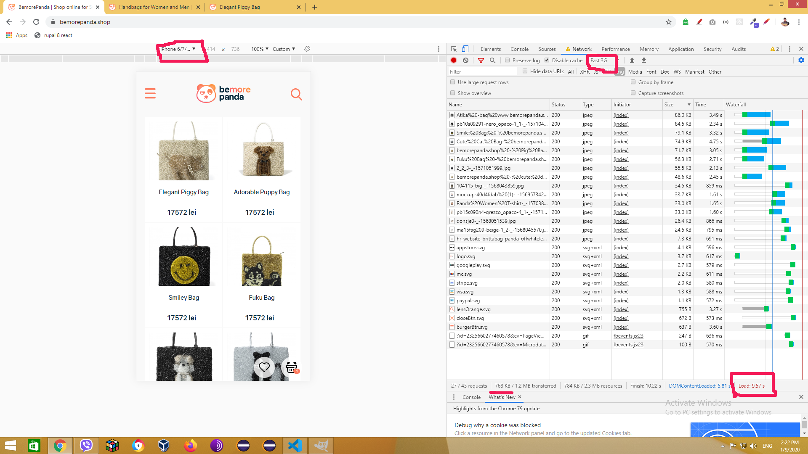
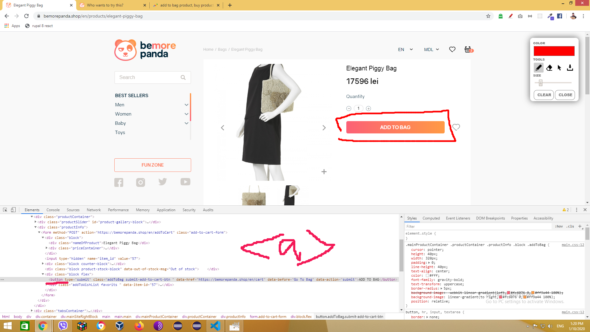

## SEO audit tehnic intern 

> pentru     bemorepanda.shop

PRESCURATI: MP - main page, CP - category's page, PP - product's page
MOB - regim mobile, DESK - desktop

1. SERVER & HOSTING
   1. HTTPS/SSL - este
   2. !!! Nu toate HEADERS (HTTPS) sunt setate corect pentru cerintele HSTS (Google 2014+)
   3. LOW TRUST ISSUE - ambele domenii sunt arendate pentru putin timp (1-2 ani), ceea ce este considerat un factor care indica riscul disparitiei proiectului (-1)
   4. dupa cum arata si ecranul 
       
      daca bemorepanda.com trebuie sa serveasca drept boost pentru shop, nu ar fi fost mai logic ca "ownerul" sa fie diferit?, in asa mod toate linkurile care duc de pe primul site spre shop - ar fi fost citate mai bine (-0.5)

2. Resource OPTIMIZATION
   1. MP,CP,PP - OFFSCREEN NOT OPTIMIZED! - imaginile care se afla mai jos de orizont - se incarca inainte sa fie vizualizate, DACA se asteapta ca traficul sa fie MOBILE FIRST - google va penaliza asa gen de uzura incorecta a traficului de biti. Dau exemplu:
    
    

    in acest ecran se poate vedea un experiment cu o viteza medie de Fast 3G (tipic pentru Moldova si zone rurale din Europa) de pe un iPhone 7+-, pagina se incarca 10 secunde (normal ar fi 1-2secunde) si 80% din imaginile incarcate utilizatorul inca nici nu le vede pe ecran - in optimizare - aceasta se considera o pierdere de trafic in van, in special in cazul in care utilizatorul nu va face scroll pana la imaginile de mai jos care nu se vad. 
    
    de exemplu urmatoarele imagini nu sunt pe ecran, dar sunt incarcate imediat

    

    

    Recomandare: IMPLIMENTAREA LAZY LOADING pentru resursele media (imagini) !!!

    1. MP,CP,PP - imaginile incarcate pentru versiunea mobil sunt prea mari pentru dimensiunea in care sunt afiate
      RECOMANDARE: utilizati HTML5 responsive images si generati automat imagini cu dimensiuni potrivite pentru marimea in care sunt afisate pe ecran

    2. MP - viteza de incarcare a paginii in cazul "BUSY SITE".
       SIMULAM 100 de utilizatori care se afla in paralel pe site. Si verificam cat timp se incarca pagina in mediu

        

       dupa cum se vede, in contextul in care fiecare utilizator face un click in mediu la 10 secunde, paginile se vor incarca cu o intarziere de 5-7 secunde... 

       PARTEA SERVER trebuie optimizata (sau scalata pe viitor) pentru ca odata pornita o campanie de publicitate, cu un server nepregatit - se poate ajunge la faptul ca multi vor pleca de pe site sau site-ul va fi penalizat de google din cauza paginilor lente (cand serverul este ocupat).

       Haide sa facem un calcul.
       - in mediu utilizatorii se afla 5 min pe zi per un site webcommerce
       - presupunem ca pe zi targetu este 10000 de sesiuni (vizualizari unice)
       - presupunem ca fiecare vizualizator vede doar 5 pagini (cazul pesimist - face doar 5 interactiuni)
       - fiecare pagina a site-ului incarca aproximativ 30+ resurse timp de 5+ secunde (reiesind din testul de mai sus)
          * calculam
            cati utilizatori vor fi in mediu in paralel pe site:
              10000 * 5min / 24 * 60min = aprox 35

       - resetam testul de mai sus :
        
        dupa cum se vede in imaginea de mai jos pentru asa o incarcatura, site-ul va oferi pentru DESK pagina in 2-3 secunde (e ok, dar se poate mai bine) - recomand optimizare resurse si server si testarea acestora INAINTE de a incepe campaniile in masa!

          

       Haideti sa mai facem un calcul, a fost presupus faptul ca cei 10000 de vizitatori vor fi distribuiti uniform pe parcursul a 24 de ore, ceea ce in conditiile reale nu este asa in 2 cazuri cel putin:
          a. Cel mai des daca shop-ul targeteaza un teritoriu (o tara, regiune) atunci utilizatorii apar pe o perioada de 8-10 ore per 24

          - testul pentru acest caz a fost elucidat mai sus (este proximativ - 100 de utilizatori in paralel pe site)

          b. Cand se lanseaza o postare publicitara noua (FB - in special!, Google) - pot exista "bursts" - fluxuri intense de trafic care depasesc uneori de 10x ori traficul obisnuit.
          
          - rulam testul cu 350 de utilizatori in paralel aflati pe site (sa zicem de 10x ori mai mult decat valoarea medie calculata de 35)

             dupa cum se vede in imaginea de mai jos, in cazul unei avalanse de vizitatori, site-ul va oferi pagini cu 13+ secunde intarziere. 
             

         REIESIND din testele de mai sus concluzia este: SAU sa se faca o optimizare/proiectare pentru scalabilitate a site-ului!, sau sa se evite campaniile publicitare care pot genera trafic de 1000+ vizualizari per minut 

         MENTIUNE: a nu se uita ca in testele de aici inca nu figureaza un site complet realizat!

         RECOMANDARE: pentru asigurarea bunii functiuni a site-ului ar fi fost util sa treaca o testare cu 10000+ produse, 100+ cosuri - prezente in paralel! 

3. URL & DOMAIN
   1. PP, IMBUNATATIRE URL 
      1. sa zicem ca am intrat pe pagina produsului "Panda Lining Boots"
         * aceasta are URL: "https://bemorepanda.shop/en/products/panda-lining-boots" 
      2. sa zicem ca am intrat pe pagina produsului "Elegant Piggy Bag"
         * aceasta are URL: "https://bemorepanda.shop/en/products/elegant-piggy-bag" 
      * NU AR FI MAI LOGIC CA SI URL-ul sa urmeze formula DOMAIN/.../CATEGORY/PRODUCT-TITLE ?
        la moment segmentul "/products/" le aduce pe toate in aceiasi "cutie" structurala. User-ul, datorita "Breadcrumb"-ului vede aceasta corect, dar google nu va vedea categorisirea prin URL!!!

        

4. HTML & SEMANTICS
   1. HEADINGS - H1-H3 
      1. MP - h1>GOL, h2>"Hello",h3>"Create new account",... - cuvinte nepotrivite in titlurile principale
      2. CP - h1>"Bags" OK!, h2> "Hello, Create new account, Reset your password, Size guides" ??, h3>GOL
      3. PP - h1>GOL, h2> aceleasi cuvinte, h3> GOL
      * !!! ANTETELE (h1,h2,h3)  - trebuiesc reparate neaparat si tre sa contina text UNIC si RELEVANT pentru tematica site-ului !!!

   2. CP - Pagina Categoriei, produsele nu au titluri semantice
       
      RECOMANDABIL e sa se utilizeze h2 sau h3
   3. PP - Pagina Produsului, lipseste titlul
       
      RECOMANDABIL e sa se utilizeze h1
   4. PP - Pagina Produsului. Se stie foarte bine ca google in ultimul timp pune accent nu doar pe cuvinte cheie, dar in ceea ce tine e-commerce si pe notiunea de "INTENT" - intentia utilizatorului, propun 2 imbunatatiri:
      1. Sa se inlocuiasca tehnic "button" cu tag-ul "a" (cu mici ajustari) pentru ca google nu prea scaneaza textele din butoane
      2. Sa se inlocuiasca fraza "add to bag" cu ceva din urmatoarele [fraze](https://trends.google.com/trends/explore?geo=US&q=add%20to%20bag%20product,buy%20product,buy%20product%20now,purchase%20product) pentru ca cuvintele utilizate aici nu au deloc relevanta in cautari
       
     
   5. PP - Pagina Produsului, aceiasi problema - nu sunt denumite produsele si sectiunile!
       
      RECOMANDABIL e sa se utilizeze h3,h4

      pentru toate punctele 2,3,4,5 - scanam site-uri bine promovate si luam exemplu de acolo!
       
   6. Rata text/HTML 
      1. MP  - 6.54%
      2. CP  - 6.40% 
      3. PP  - 7.22%

      aceasta rata este foarte joasa in cazul in care site-ul pune accent pe continut textual, se recomanda cel putin 10%, bine ar fi 15%, ideal ar fi 25+%

      RECOMANDARE - reducearea numarului mare de clase,denumiri de clase si elemente de tip "div", scoaterea stilurilor, scripturilor din macheta in fisere separate!
   7. PP - atentie in HEAD sunt unele incalcari, ca de exemplu - dublarea tag-ului keywords si description!
       
   8. MP,CP,PP - din punct de vedere semantic DIV-uril in HTML nu indica subordonarea categoriei "Clothes" fata de categoria "Baby", nu ar fi mai logic sa se realizeze o lista cu subliste in baza UL/LI ?
       
   9. PP - relevanta acestui text? "View Products" - dupa mine fraza potrivita e "Product Description"  
      
      
5. Micro Markup & Structured Data
   1. MP,CP,PP -> Schema.org - !!! LIPSESTE marcarea semantica !!! 
      * Recomandari:
        1. Sa se adauge tipul "https://schema.org/Store" asociat cu intregul magazin
        2. Sa se adauge tipul "https://schema.org/Product"  asociat cu fiecare produs din magazin
        3. Sa se adauge tipul "https://schema.org/SellAction" asociat cu pagina produsului si formularul de "vanzare" a produsului
        4. Sa se verifice validatea datelor adaugate prin "https://search.google.com/structured-data/testing-tool" 

   2. Open Graph (pentru facebook) nu este formatat corect, pentru promovare automata pe FACEBOOK:
      1. MP - lipseste tag-ul "org:image" - lipseste 
      2. PP - org:title -> nu corespunde cu titlul CATEGORIEI, org:description - GOL, org:image - lipseste!
      3. PP - org:title -> nu corespunde cu titlul produsului, org:description - GOL, org:image - lipseste!

6. UX / UI
   1. SEARCH BAR

       

      1. Ar fi bine ca rezultatele cautarii produselor sa contina si pretul acestora, ar accelera viteza de interactiune 
      2. Ar fi bine ca numarul de rezultate (javascript) sa se adapteze dinamic dupa inaltimea ferestrei, sa nu fie permanent doar 3 afisate (daca e posibil!)
      3. Viteza de incarcare a rezultatelor este foarte mica (si acum nu sunt multi cumparatori pe site) imaginati-va cand un utilizator intra apasa 3 litere si asteapa 3+ secunde sa apara rezultatul?
      
        !!! RECOMANDAREA este sa se optimizeze (caching sau preloading) macar cele mai popular 200-300 de rezultate, de altfel - acest search arata frumos, dar din punct de vedere UX - nu are valoare.

        Facem test:

          a. Regimul obisnuit (sunt doar eu, poate inca 2-3 persoane pe site) rulez "bag" in cautare, din momentul in care am batut aceste 3 litere rezultatul a aparut vizual peste 1.2 secunde (0.15 secunde s-a incarcat de pe server - ceea ce este rapid! si restul - a fost desenat in frontend! - asta fiind FOARTE LENT!!!!, deci de pe desktop, calculatorul meu performant il deseneaza in 1.5 secunde aprox)

          

          b. Regim MOB, XIAOMI Redmi 5,6 - SEARCH BAR, bat "bag" in cautare, astept deja de 1 ora :D nu apare nimic ?

          c. Regim site incarcat MOB, am pornit o utilita care simuleaza faptul ca inca 100 de utilizatori sunt pe site in paralel si fac interactiuni cu paginile, Bat in cautare "bag"
             serverul raspunde peste 2.5sec + 1.2 secunde se deseneaza rezultatul, deci cand site-ul e BUSY, utilizatorul introducand o careva fraza asteapta aproape 4 secunde rezultatul cautarii. 
             !!! CAUTAREA INTERACTIVA se considera un punct cheie in promovarea E-commerce!!! TREBUIE OPTIMIZATA!!!

             

      4. MOB,DESK - TOO MANY INTERACTIONS, Urmati pasii: apasam pictograma "search" apoi activam campul printr-un click (touch de pe MOB) apoi abia putem incepe sa cautam. 
        !!! RECOMANDARE - reduceti etapa de activare a campului, asa incat cum activez search - imediat sa pot culege textul! 

   2. PRODUCT INTERACTION
      1. MOB, Urmam pasii: Intru pe catalog, dau mai multe scroll-uri pentru a vedea ce produse mai sunt, ajung la al 2-lea, la al 3-lea ecran, vad un produs ce ma intereseaza, intru pe el, citesc, vreau sa revin inapoi in acelasi loc de unde am trecut pe produs, cum fac :D?
   3. CART INTERACTION
      1. MOB, Urmam pasii: Intru pe catalogul produselor, dau scoll vreo 2-3 pagini in jos, selectez din catalog un produs, mai dau scroll, mai selectez alt produs si pun in cos, vad iconita cosului,  vreau sa verific ce am in cos, apas pe cos, nimeresc pe pagina cosului - E OK am vazut ce produse am, vreau sa revin inapoi la la catalog in pozitia unde ma aflam, ca sa continui selectia - cum fac? :D 
