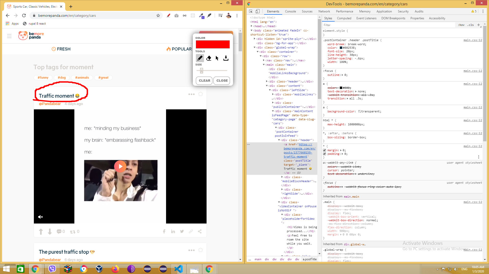

## SEO audit tehnic intern 

> pentru www.bemorepanda.com
> pentru     bemorepanda.shop

1. domain name / owner / URL
   1. LOW TRUST ISSUE - ambele domenii sunt arendate pentru putin timp (1-2 ani), ceea ce este considerat un factor care indica riscul disparitiei proiectului (-1)
   2. dupa cum arata si ecranul 
       
      daca bemorepanda.com trebuie sa serveasca drept boost pentru shop, nu ar fi fost mai logic ca "ownerul" sa fie diferit?, in asa mod toate linkurile care duc de pe primul site spre shop - ar fi fost citate mai bine (-0.5)
    3. Exista cuvinte inutile in adrese, de ex:
       1. "bemorepanda.com/en/**tag**/dog" - pagina de cautare dupa tag-ul dog, la ce bun este cuvantul "tag" ? acesta dizolva semantica tuturor adreselor care se formeaza in baza tag-urilor
       2. "bemorepanda.com/en/**posts**/**1573838480**-someones-soul-is-definitely-trapped-in-there-im-sure-of-it" - pagina oricarei postari? aceasta nu este un CLEAN URL, in primul rand contine "posts" - dizolva, contine timestampul "1573838480" si contine cuvinte cu relevanta redusa care de obicei se filtreaza automat gen "in", "of", "for" etc... ceea ce duce la scaderea importantei textului url-ului in cautare. Ar trebui sa se aplice principiul celor 5-7 cuvinte si toate sa fie relevante!
       3. aceiasi problema e si in categorii: "bemorepanda.com/en/**category**/fashion-and-beauty" - "category" este un cuvant care nu participa in cautari aproape deloc! totusi el este dublat un URL pentru fiecare categorie si ocupa 30%+ din continutul adresei.
       * deci o buna parte din URL-uri sunt "diluate" si se dubleaza partial (coeficientul de unicitate e foarte scazut!)
       * ca sa fie mai clar, aduc pentru comparatie un screen legat de frecventa cautarilor vs compozitia frazei de cautare:
        
            

          zero cautari utilizand combinatia de cuvinte "category fashion and beauty", cu cat mai laconic e textul in punctele cheie ale unei pagini, cu atat mai revelant va fi rezultatul! 

      
2. Technical HTML
   1. sunt erori grave in HTML (noscript cu "img") in head??? (-0.5)
   2. urmatorul ecran vorbeste de la sine (-1)
             
      
      asa gen de erori pot crea mai departe sute de erori de PARSING (citire) a continutului!
   3. elementul MAIN nu este utilizat corect - in el apar elemente care SE REPETA PE FIECARE PAGINA! desi acesta tre sa contina partea unica a continutului fiecarei pagini! (-1)
          
   4. Lipsesc elemente semantice esentiale: HEADER, FOOTER, SECTION, ASIDE, ARTICLE
   5. heading-urile statice contin text IRELEVANT (h1,h2,h3)    
      
       
   6. care este reason-ul acest element - pana sa se incarce dinamic HTML prin javascript sa contina H1 - cu video is being processed... ? dupa care in loc de H1 sa se incarce un link aici cu titlul? 

        

      in cel mai rau caz acesta ar fi un text bine de plasat in H3 sau H2 

3. Resources
   1. imaginile nu sunt responsive (se incarca aceleasi fisiere pentru orice ecran)
       
   2. este oare bine sa gazduiti materialele video direct pe hosting-ul propriu? cat va costa hosting-ul cand vor fi 10000+ vizualizari pe zi din care cel putin 50% vor fi materiale video? nu e mai simplu sa se integreze un canal youtube?
   3. Din punct de vedere UI/UX mi se pare gresit sa se porneasca autoplay - E UNA la mana faptul ca facebook isi permite (pentru ca traficul de pe retele sociale nu este contorizat aproape de nici un provider de telefonie mobila) in schimb traficul de pe website-ul DVS este contorizat, eu intentionat am facut asa un scenariu - daca userul face scroll pana in drept cu un video si intamplator este deranjat de cineva si se opreste acolo fara intentia de a viziona, in 60 de secunde i s-au dus un scroll de 10 ecrane in jos mi-a luat parox 14mb din trafic, fara ca eu sa fiu interesat de vreun video. 

     
   
   Ar trebui cel putin undeva sa fie optiunea aceasta

     
       
4. Adaptivitate & UX / UI
   1. Care este reason-ul sa apara aceasta inscriptie in versiunea Mobila - atunci cand ecran e si asa putin, in timp ce pe versiunea Desktop - ea lipseste?

    

   1. 